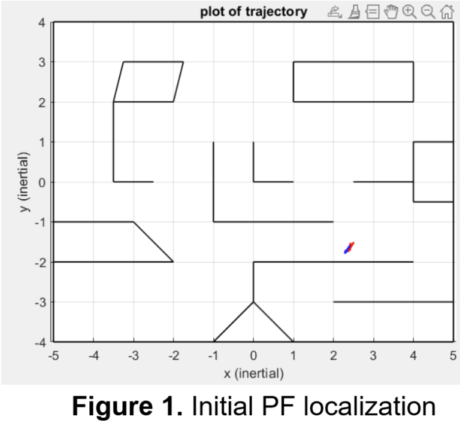
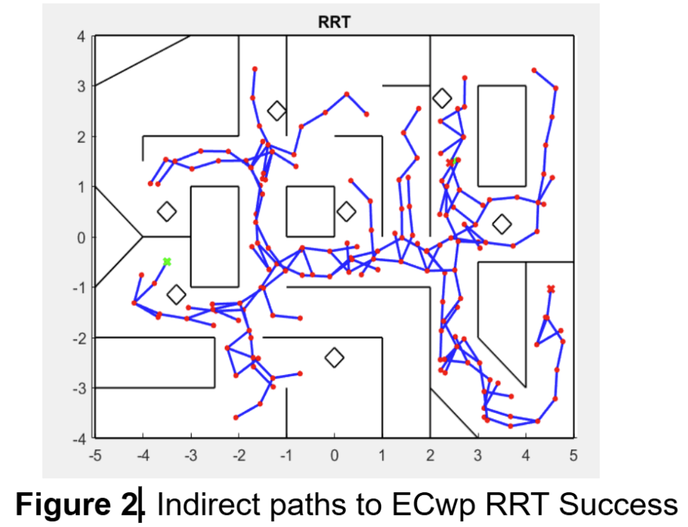
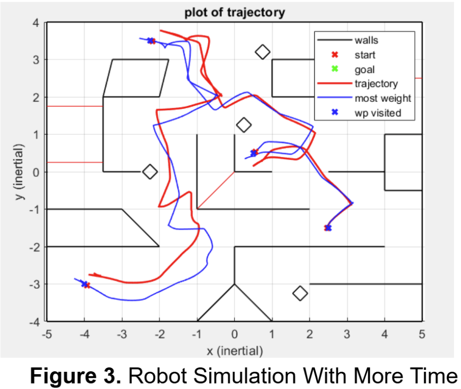

# Autonomous Robot Localization and Navigation System

This project was developed for the **ECE4180 Final Competition** at Cornell University. Our robot autonomously localized itself from an unknown starting point, planned collision-free paths using global planning algorithms, and navigated through a mapped environment while detecting obstacles in real time.

> **Embedded systems project** implemented in **MATLAB**, deployed on a **real Roomba robot**, with live testing and performance results.

---

## Project Overview

- Combined **Particle Filter (PF)** for localization and **RRT + Dijkstra** for path planning.
- Localized from an unknown pose using a 360° sensor sweep and initialized 700 particles.
- Dynamically updated the map with optional walls detected via bump sensing.
- Planned paths around stay-away zones and optimized traversal of standard and extra credit waypoints.
- Developed robust real-time visualization tools for debugging and performance tuning.

---

## Key Features

- **Accurate Localization**  
  PF tracked robot pose with ±0.1 m accuracy during turns and linear motion.

- **Hybrid Navigation Strategy**  
  RRT generated global paths; Dijkstra selected the optimal route to each waypoint.

- **Modular Real-Time Control**  
  Robot continuously re-planned paths and updated belief states during runtime.

- **Obstacle Detection & Map Update**  
  Optional walls were added to the map dynamically based on bump sensor readings.

- **Visualization Tools**  
  Live plots of robot trajectory, particles, RRT roadmaps, and stay-away zones.

---

## Competition Result

While the robot performed robustly and accurately in simulation and physical tests, strict speed and time limits in the final run prevented reaching all waypoints. Nevertheless, the system showed strong localization, navigation, and adaptability, making it an excellent showcase of embedded robotics and systems engineering.

---

## Repository Structure 

